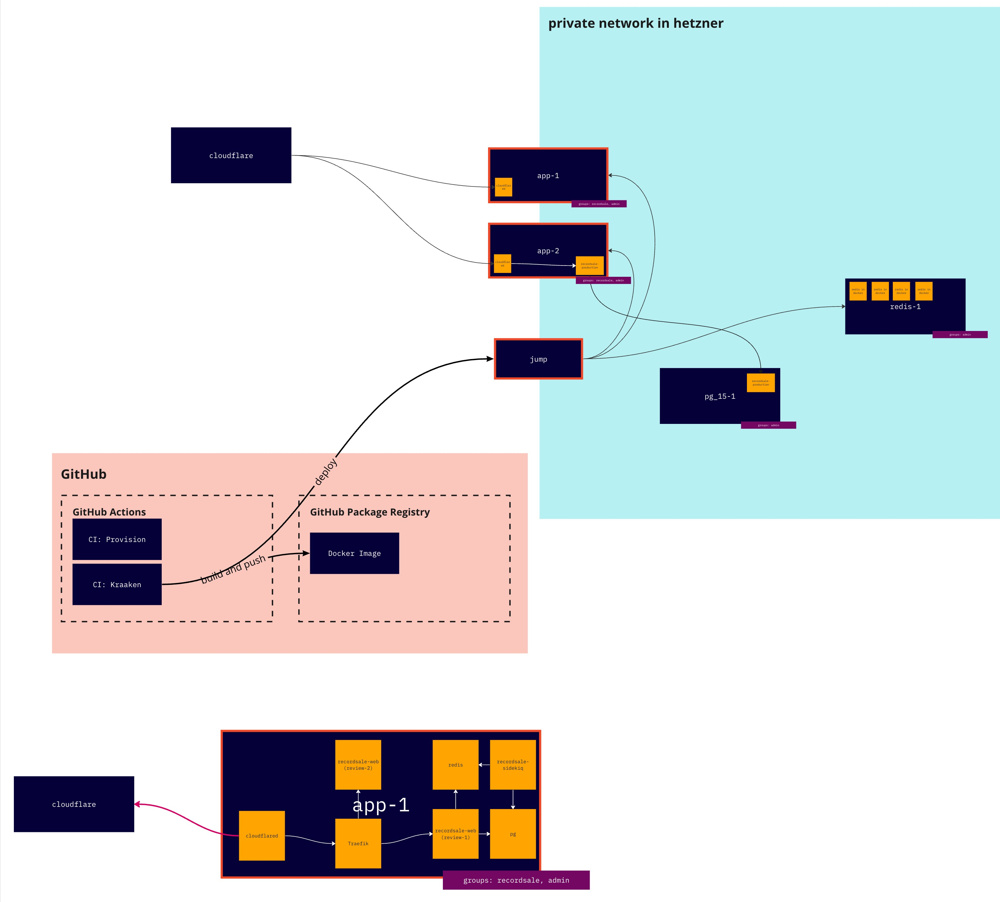

#  Kraaken 🐙: Containerized Deployment  🐳

Kraaken, provides a series of docker commands to orchestrate your containerized applications' deployment! It is nothing more than scripts which would normally have to be done by hand to automate things like:

*   Cloudflare tunneling
*   Hetzner server provisioning
*   Traefik configuration
*   1Password secret management sync with environment variables

## Requirements

*   [1Password CLI ]("https://developer.1password.com/docs/cli/get-started/#install") (Managing Secrets)
*   [BuildJet Github Addon ]("https://github.com/marketplace/buildjet") (Deployment with ARM)

## Example Deployment Workflow


*   A jump host stands between the local developer environment and the server.

## Installation

Add Kraaken to your Gemfile:


```ruby
group :development do
  gem 'kraaken'
end
```

Then, run the following command to install the gem:

```zsh
bundle install
```

## Usage

Kraaken provides several commands to streamline your containerized deployment process:

### Commands

*   `kraaken app credentials`:  Opens the credentials file, reads the `.env` file from the server.
*   `kraaken app deploy`: Deploys the app, Creates a directory and `.env` file, copies `docker-compose.yml` to the server, pulls from the registry, and starts up the container.
*   `kraaken app destroy`: Destroys the app, closes the docker container along with volumes.
*   `kraaken app logs`: Shows the logs of the app, follows logs of the container.

*   `kraaken ssh config` Updates the local ssh config file

*   `kraaken server provision <app-name>` Provision a new server
*   `kraaken server list ` Lists all current servers

### Configuration Files

#### docker-compose.yml

\[example for `docker-compose.yml`\]

#### build.yml

```yaml
name: build

on:
  push:

jobs:
  deploy:
    runs-on: buildjet-4vcpu-ubuntu-2204
    permissions:
      contents: read
      packages: write

    env:
      DOCKER_BUILDKIT: 1
      REGISTRY: ghcr.io
      REPOSITORY: ${{ github.repository }}
      REPOSITORY_OWNER: ${{ github.repository_owner }}
      PLATFORM: arm64

    steps:
      - name: Checkout code
        uses: actions/checkout@v4

      - name: Set up Docker Buildx
        uses: docker/setup-buildx-action@v3

      - name: 'Login to GitHub Container Registry'
        uses: docker/login-action@v3
        with:
          registry: ${{ env.REGISTRY }}
          username: ${{ github.actor }}
          password: ${{ secrets.GITHUB_TOKEN }}

      - name: Build and push image (latest and sha)
        if: github.ref == 'refs/heads/main' || github.ref == 'refs/heads/master'
        uses: docker/build-push-action@v5
        with:
          context: .
          push: true
          platforms: ${{ env.PLATFORM }}
          cache-from: type=gha
          cache-to: type=gha,mode=max
          tags: |
            ${{ env.REGISTRY }}/${{ env.REPOSITORY_OWNER }}/${{ env.REPOSITORY }}:${{ github.sha }}
            ${{ env.REGISTRY }}/${{ env.REPOSITORY_OWNER }}/${{ env.REPOSITORY }}:latest

      - name: Build and push image (sha only)
        if: github.ref != 'refs/heads/main' && github.ref != 'refs/heads/master'
        uses: docker/build-push-action@v5
        with:
          context: .
          push: true
          platforms: ${{ env.PLATFORM }}
          cache-from: type=gha
          cache-to: type=gha,mode=max
          tags: |
            ${{ env.REGISTRY }}/${{ env.REPOSITORY_OWNER }}/${{ env.REPOSITORY }}:${{ github.sha }}
```

## Questions
### How do I get access to the network?
SSH keys can be managed via cloud_config file.

### Why is there no load balancer?
We utilize cloudflare handles this for us via proxied domain.

## Contributing

Bug reports and pull requests are welcome on GitHub at [Kraaken's repository](https://github.com/nerdgeschoss/kraaken). We are committed to fostering an inclusive and welcoming environment. Please read our [code of conduct](https://github.com/nerdgeschoss/kraaken/blob/master/CODE_OF_CONDUCT.md) for guidelines on participation.

## License

This gem is available under the MIT License. See [LICENSE](https://opensource.org/licenses/MIT) for more details.

## Code of Conduct

We expect all contributors to follow our [Code of Conduct](https://github.com/nerdgeschoss/kraaken/blob/master/CODE_OF_CONDUCT.md) to ensure a positive and inclusive environment for everyone involved in this project.

This revised README provides clear instructions, a concise description, and maintains a professional and welcoming tone. It also includes placeholders for specific instructions related to `docker-compose.yml`, and `build.yml` which should be filled in with relevant details.
